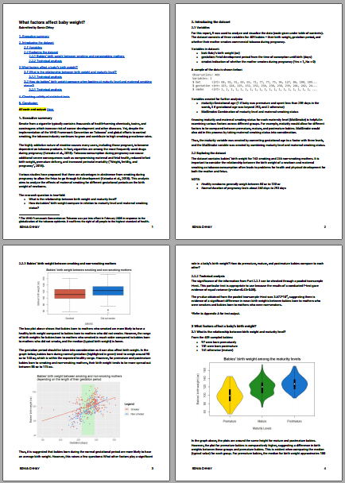
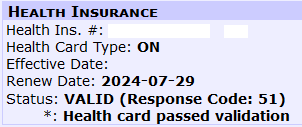
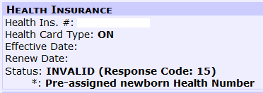
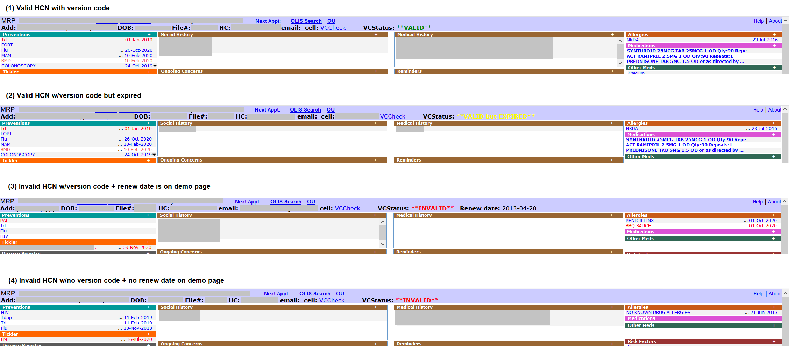
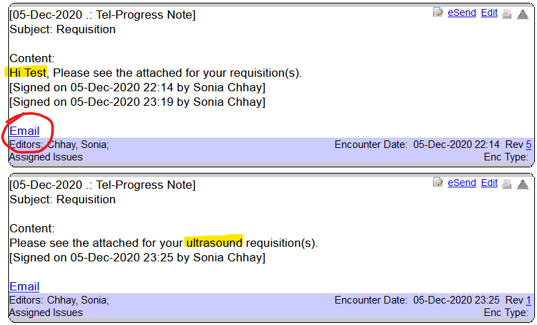
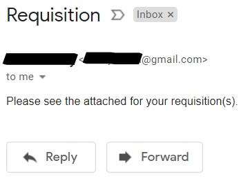

## C:\Portfolio>_

Here are some samples of my work. I hope you enjoy reading them! 📁   

### Data Analysis Portfolio
- <a href="{{ 'SoniaChhay_Submission.pdf'   | relative_url }}">What Factors Affect Baby Weight?</a> 
- 

    
## OSCAR Projects

(Scripts and PHI redacted)   

### Display Healthcard Status on Demo Page
- When opening the demo page for a patient on OSCAR, it will automatically grab the info (renew date, status, message) from the card swipe page and update it on the demo page (works for missing version codes too)
- 
- 

### Display Healthcard Status on EChart + blink alert
- Shows the healthcard status in the echart header & includes renew date 
- It will display valid HC (green), valid but expired HC (yellow), invalid or no HC (red) -> also differentiates if patient is IFH
- Alert if no healthcard on record
- Version code status (e.g. **INVALID**) will blink 5 times if HC is invalid/valid but expired/missing
- 

### Compose Email on EChart + Autopopulate
- Allows user to compose email on echart/use templates provided in OSCAR and send with default email client
- Autopopulates subject and content of email using template format
- Ability to edit notes on echart + send email with those changes
- Email button only appears on echart notes with email template to ensure only the info that should be sent, can be sent
- 
- 
